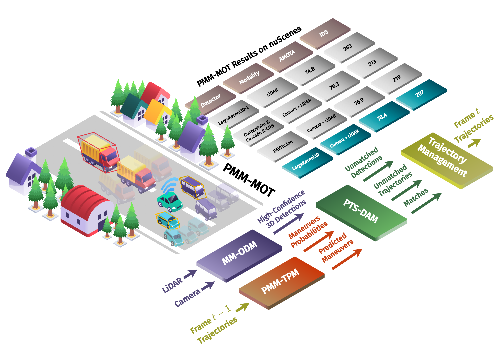
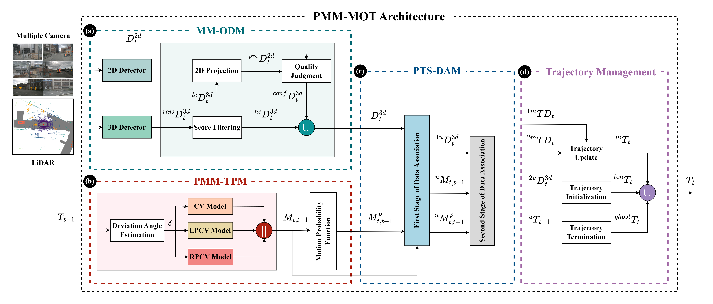
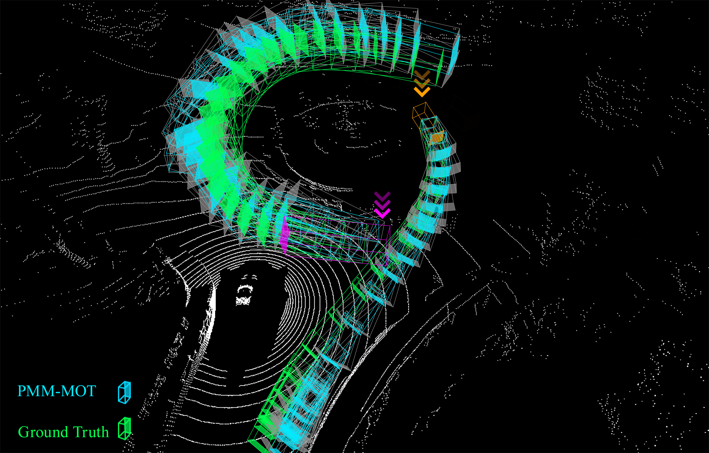
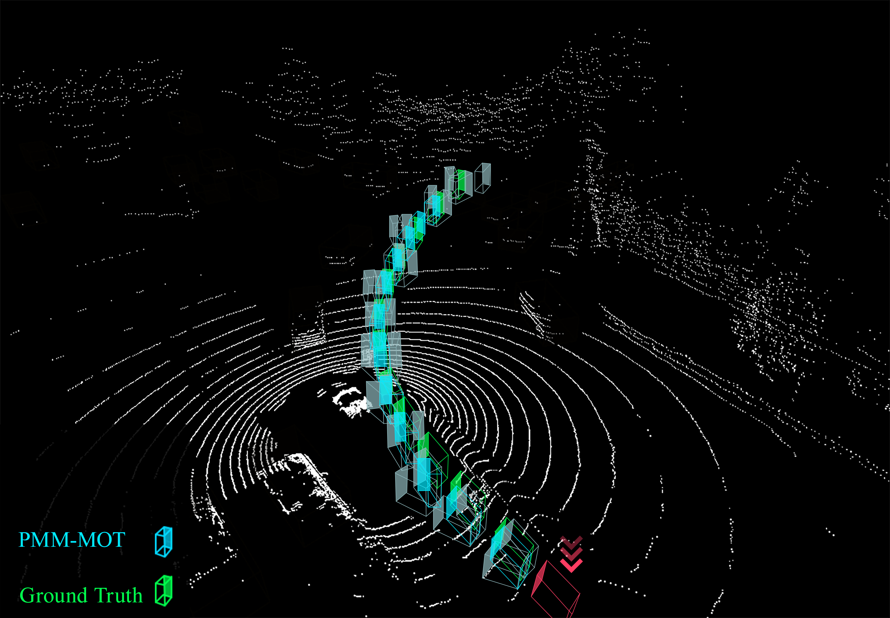

> **Note:** The source code for this project will be added soon. Stay tuned for updates!

# Abstract

> 🎯 **Key Innovation**: A dynamic probabilistic multi-model framework for 3D multiple object tracking that adapts to uncertain environments.

## 🔍 Problem Statement
3D multiple object tracking is crucial for:
- Intelligent navigation systems
- Autonomous vehicles
- Continuous localization
- Object re-identification

## 💡 Challenges Addressed
- Traditional simple motion models (constant velocity/acceleration) struggle with:
  - Abrupt maneuvers
  - Collision avoidance scenarios
  - Curiosity-driven exploration
  - Dynamic scene changes
- Category-specific motion models:
  - Only slightly improve accuracy
  - Increase system complexity
  - Struggle with atypical maneuvers

## 🚀 Our Solution
We propose a framework that:
- Uses multiple parallel motion models
- Introduces two novel motion models based on learned probabilistic multi-category deviation angles
- Combines with constant velocity model for three trajectory predictions
- Employs logistic regression for momentum-based probability estimation

## 📊 Results Highlights
Achieved state-of-the-art performance:
- **KITTI Benchmark**:
  - Cars: **80.27%** tracking accuracy
  - Pedestrians: **52.48%** tracking accuracy
- **nuScenes Benchmark**:
  - **75.5%** average multi-object tracking

## 📑 Architecture
PMM-MOT is divided into four separate modules: multi-modal 3D object detection (MM-ODM), probabilistic multi-motion trajectory prediction (PMM-TPM), probabilistic two-stage data association (PTS-DAM), and trajectory management

## 🏆 Benchmark Results
### Evaluation results on KITTI 2D tracking benchmark:
| Tracking Benchmark            | Sensor Modality   | HOTA⬆️     | AssA⬆️     | MOTA⬆️     | HOTP⬆️     | FN⬇️     | FP⬇️     | IDS⬇️      |
| :---------------------------: | :---------------: | :--------: | :--------: | :--------: | :--------: | :--------: | :--------: | :--------: | 
| KITTI (*car* category)        | LiDAR             | 79.3       | 82.5       | 86.2       | 85.9       | 327        | 3461       | 210        | 
| KITTI (*car* category)        | Camera + LiDAR    | 80.2       | 83.1       | 87.0       | 87.1       | 264        | 3026       | 149        | 
| KIITI (*pedestrian* category) | Camera + LiDAR    | 52.4       | 59.3       | 64.7       | 74.9       | 936        | 6977       | 248        | 

### Evaluation results on nuScenes validation set using various detectors:
| Detector                    | Sensor Modality | AMOTA    | AMOTP    | IDS     |
| :---------------------------: | :---------------: | :--------: | :--------: | ------- |
| LargeKernel3D-L             | LiDAR           | 74.8     | 54.9     | 263     |
| CenterPoint & Cascade R-CNN | Camera + LiDAR  | 76.3     | 54.7     | 213     |
| BEVFusion                   | Camera + LiDAR  | 76.9     | 56.2     | 219     |
| LargeKernel3D               | Camera + LiDAR  | **78.4** | **54.4** | **207** |

## 🎥Visualization 
PMM-MOT qualitative results on sene-0998 (frame 3 to 25) and scene-1048 (frames 21 50 3) of the nuScenes dataset:
- **🚌 🚗Scene-0998**: The depicted car and bus objects must navigate the town square by performing a curve maneuvering (highlighted by green 3D bounding boxes as the ground truth) to proceed successfully. 
- **🏍️ Scene-1048**: Scene-1048 involves tracking a motorcycle, characterized by its agile and often unpredictable movements.

*PMM-MOT operates by dynamically predicting the upcoming position of each object (blue 3D bounding boxes) based on potential maneuvers (gray 3D bounding boxes) and their probability of occurrence. This approach allows PMM-MOT to smoothly handle transitions, such as when vehicles switch between straight-line driving and turning or perform atypical maneuvers, without requiring category-specific modeling. This robust adaptability ensures more reliable long-term tracking, fewer lost objects, and improved trajectory smoothness across varying motion patterns.*
 **Scene-0998**

 **Scene-1048**

## Resources for calculating the average mass of objects
The table below indicates the resources for calculating the average mass of each category of objects:

| Category   | Average Mass (kg)     | References                                                                                                                                                                                                                                                                               |
| :----------: | :-----------------: | ---------------------------------------------------------------------------------------------------------------------------------------------------------------------------------------------------------------------------------------------------------------------------------------- |
| Pedestrian | 70                | 1: [https://www.cdc.gov/nchs/data/series/sr_03/sr03-046-508.pdf](https://www.cdc.gov/nchs/data/series/sr_03/sr03-046-508.pdf) 2: [https://en.wikipedia.org/wiki/Human_body_weight](https://en.wikipedia.org/wiki/Human_body_weight)                                                   |
| Bicycle    | 80                | [https://www.bikesales.com.au/](https://www.bikesales.com.au/)                                                                                                                                                                                                                           |
| Motorcycle | 200               | [https://www.cycleworld.com/](https://www.cycleworld.com/)                                                                                                                                                                                                                               |
| Car        | 1,500             | [The 2020 EPA Automotive Trends Report](https://www.epa.gov/sites/default/files/2021-01/documents/420r21003.pdf)                                                                                                                                                                         |
| Bus        | 12,000            | [The 2020 EPA Automotive Trends Report](https://www.epa.gov/sites/default/files/2021-01/documents/420r21003.pdf)                                                                                                                                                                         |
| Trailer    | 1,500             | 1: [https://www.amazon.com/Driving-Instructors-Handbook-John-Miller/dp/0749483938](https://www.amazon.com/Driving-Instructors-Handbook-John-Miller/dp/0749483938) 2: [The 2020 EPA Automotive Trends Report](https://www.epa.gov/sites/default/files/2021-01/documents/420r21003.pdf) |
| Truck      | 9,000             | 1: [https://www.amazon.com/Driving-Instructors-Handbook-John-Miller/dp/0749483938](https://www.amazon.com/Driving-Instructors-Handbook-John-Miller/dp/0749483938) 2: [The 2020 EPA Automotive Trends Report](https://www.epa.gov/sites/default/files/2021-01/documents/420r21003.pdf) |
