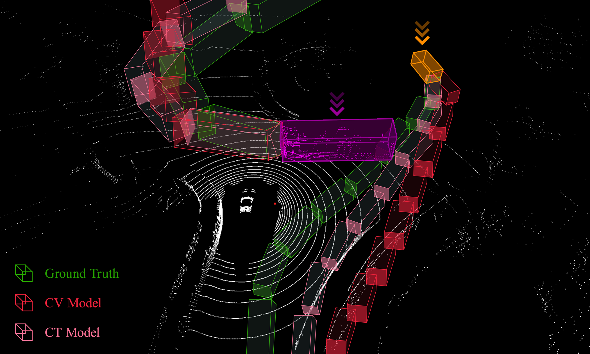
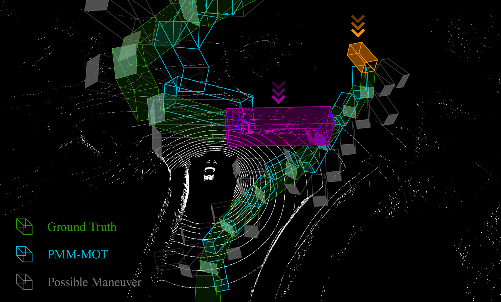

> **Note:** The source code for this project will be added soon. Stay tuned for updates!

# Abstract

> 🎯 **Key Innovation**: A dynamic probabilistic multi-model framework for 3D multiple object tracking that adapts to uncertain environments.

## 🔍 Problem Statement
3D multiple object tracking is crucial for:
- Intelligent navigation systems
- Autonomous vehicles
- Continuous localization
- Object re-identification

## 💡 Challenges Addressed
- Traditional simple motion models (constant velocity/acceleration) struggle with:
  - Abrupt maneuvers
  - Collision avoidance scenarios
  - Curiosity-driven exploration
  - Dynamic scene changes
- Category-specific motion models:
  - Only slightly improve accuracy
  - Increase system complexity
  - Struggle with atypical maneuvers

## 🚀 Our Solution
We propose a framework that:
- Uses multiple parallel motion models
- Introduces two novel motion models based on learned probabilistic multi-category deviation angles
- Combines with constant velocity model for three trajectory predictions
- Employs logistic regression for momentum-based probability estimation

## 📊 Results Highlights
Achieved state-of-the-art performance:
- **KITTI Benchmark**:
  - Cars: **80.27%** tracking accuracy
  - Pedestrians: **52.48%** tracking accuracy
- **nuScenes Benchmark**:
  - **75.5%** average multi-object tracking

## Architecture
PMM-MOT is divided into four separate modules: multi-modal 3D object detection (MM-ODM), probabilistic multi-motion trajectory prediction (PMM-TPM), probabilistic two-stage data association (PTS-DAM), and trajectory management

## Benchmark Result
### The PMM-MOT results on nuScenes validation set:
| Detector                    | Sensor Modality | AMOTA    | AMOTP    | IDS     |
| :---------------------------: | :---------------: | :--------: | :--------: | ------- |
| LargeKernel3D-L             | LiDAR           | 74.8     | 54.9     | 263     |
| CenterPoint & Cascade R-CNN | Camera + LiDAR  | 76.3     | 54.7     | 213     |
| BEVFusion                   | Camera + LiDAR  | 76.9     | 56.2     | 219     |
| LargeKernel3D               | Camera + LiDAR  | **78.4** | **54.4** | **207** |

## Visualization of Results
Visualization of PMM-MOT result at sene-0998 (frame 4) of nuScenes dataset

# Resources for calculating the average mass of objects
The table below indicates the resources for calculating the average mass of each category of objects:

| Category   | Average Mass (kg)     | References                                                                                                                                                                                                                                                                               |
| :----------: | :-----------------: | ---------------------------------------------------------------------------------------------------------------------------------------------------------------------------------------------------------------------------------------------------------------------------------------- |
| Pedestrian | 70                | 1: [https://www.cdc.gov/nchs/data/series/sr_03/sr03-046-508.pdf](https://www.cdc.gov/nchs/data/series/sr_03/sr03-046-508.pdf) 2: [https://en.wikipedia.org/wiki/Human_body_weight](https://en.wikipedia.org/wiki/Human_body_weight)                                                   |
| Bicycle    | 80                | [https://www.bikesales.com.au/](https://www.bikesales.com.au/)                                                                                                                                                                                                                           |
| Motorcycle | 200               | [https://www.cycleworld.com/](https://www.cycleworld.com/)                                                                                                                                                                                                                               |
| Car        | 1,500             | [The 2020 EPA Automotive Trends Report](https://www.epa.gov/sites/default/files/2021-01/documents/420r21003.pdf)                                                                                                                                                                         |
| Bus        | 12,000            | [The 2020 EPA Automotive Trends Report](https://www.epa.gov/sites/default/files/2021-01/documents/420r21003.pdf)                                                                                                                                                                         |
| Trailer    | 1,500             | 1: [https://www.amazon.com/Driving-Instructors-Handbook-John-Miller/dp/0749483938](https://www.amazon.com/Driving-Instructors-Handbook-John-Miller/dp/0749483938) 2: [The 2020 EPA Automotive Trends Report](https://www.epa.gov/sites/default/files/2021-01/documents/420r21003.pdf) |
| Truck      | 9,000             | 1: [https://www.amazon.com/Driving-Instructors-Handbook-John-Miller/dp/0749483938](https://www.amazon.com/Driving-Instructors-Handbook-John-Miller/dp/0749483938) 2: [The 2020 EPA Automotive Trends Report](https://www.epa.gov/sites/default/files/2021-01/documents/420r21003.pdf) |
