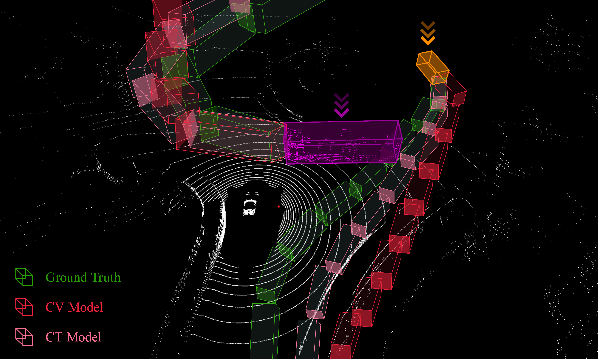

# PMM-MOT
A Probabilistic Multi-Motion Framework for 3D Multi-Object Tracking

## Abstract
3D multi-object tracking (3D MOT) plays a vital role in autonomous driving systems, primarily due to its ability for continuous 3D localization and re-identification (Re-ID) of surrounding objects. Existing methods rely solely on a simple motion model (e.g., constant velocity (CV)) to predict the subsequent state of each active trajectory. However, in the face of uncertain environmental conditions, objects may alter their motion models and perform abrupt maneuvers influenced by factors like collision avoidance with nearby objects, curiosity-driven exploration, and scene dynamics, which hinder the effectiveness of such methods. As such, a probabilistic multi-motion 3D MOT (PMM-MOT) framework is proposed, which employs multiple parallel motion models to enhance prediction accuracy by considering potential object maneuvers. To achieve this, PMM-MOT introduces two new motion models, left probabilistic CV (LPCV) and right probabilistic CV (RPCV), restricting possible object maneuvers within a confined probabilistic space based on a dynamic multi-category deviation angle. Each prediction comes with its own probability of occurrence which must be considered during the association process. Toward this end, PMM-MOT introduces the Motion Probability Function, which calculates the probability of each prediction based on the object's momentum. Additionally, two new probabilistic cost functions are introduced to update active trajectories using 3D detections through a two-stage data association process, prioritizing high probability predictions. Extensive experiments conducted on the nuScenes dataset confirm the superior performance of the PMM-MOT framework compared to other state-of-the-art trackers with an AMOTA of **78.4**. 

## PMM-MOT architecture

## Visualization
Visualization of PMM-MOT result at sene-0998 (frame 4) of nuScenes dataset

